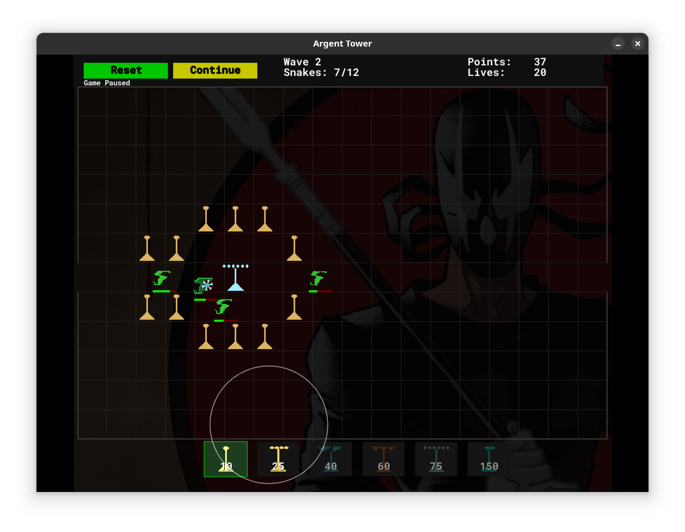

# Argent Tower

When I was younger, I fell in love with Desktop Tower Defense and I've always wanted to build something like it. This is my take on the classic tower defense genre, written in Go using the Ebitengine game framework. It is a very early, near prototype, version, but it runs correctly, spawns enemies, and everything is functional!

## About the Author

I am Hunter Rose and can be found on [X](https://x.com/HunterR0se). I've been writing code for a few decades and recently decided to complete all the projects I started and never finished. My code repository is [on github](https://github.com/HunterR0se) and includes some AI work, some Rust code, a lot of Go code, and even a Bitcoin Key Generation system that uses CUDA acceleration (Grendel).

## About the Game



Argent Tower is a strategic tower defense game where you must protect your territory from waves of increasingly difficult enemies. Place and upgrade towers tactically to create mazes and kill enemies before they reach the exit.

### Grab the binary

I keep the latest compiled binary in the bin tree. Grab it here.

[Argent Tower Linux](bin/argent)

### Features

- 6 unique tower types each with different abilities:

    - Dart Tower: Basic rapid-fire tower
    - Bullet Tower: Long range, high accuracy
    - Lightning Tower: Electric attacks with chain effects
    - Flame Tower: Area damage with burning effects
    - Freeze Tower: Slows enemies with ice attacks
    - Fork Tower: Powerful but limited to 10 per game

- 4 enemy types with unique behaviors:

    - Spiders: Basic enemies that follow paths
    - Snakes: Can attack and damage towers
    - Hawks: Fast moving aerial units
    - Ghouls: Ethereal enemies that actively target towers

- Dynamic gameplay mechanics:
    - Enemies pathfind around your tower maze
    - Towers show damage visually as they're attacked
    - Multiple projectile types with unique effects
    - Special death animations for enemies
    - Wave-based progression system
    - Resource management with points/money

## Building & Running

The game is completely self-contained and requires no external assets. To build:

```bash
go build -o bin/argent
```

Then simply run the binary:

```bash
./bin/argent
```

## How to Play

1. Start in building mode - place towers strategically to create a maze
2. Click "Begin" when ready to start the waves
3. Enemies enter from the left and try to reach the right
4. Each enemy that escapes costs you a life
5. Earn points by killing enemies to build more towers
6. Survive increasingly difficult waves of enemies

### Controls

- Left click: Place selected tower
- Right click: Remove tower (get partial refund)
- Mouse over tower: See attack range
- Click tower buttons: Select tower type to build

### Strategy Tips

- Create long winding paths to maximize enemy exposure
- Use Freeze towers to slow enemies for other towers
- Protect your towers from Snake and Ghoul attacks
- Don't block all paths - enemies must have a way through
- Start with basic Dart towers and upgrade strategically

## Credits

A modern reimagining of Paul Preece's Desktop Tower Defense, written in Go using:

- [Ebitengine](https://ebiten.org/) - 2D game engine
- [Go](https://golang.org/) - Programming language
- Original pixel art and design

- The original [Desktop Tower Defense](https://en.wikipedia.org/wiki/Desktop_Tower_Defense)

# Overview of the original

Desktop Tower Defense is a Flash-based tower defense browser game created by Paul Preece in March 2007.

_Desktop Tower Defense is played on a map resembling an office desktop. The player must stop a set number of enemies, known in the genre as "creeps", from reaching a set point on the playing field. This is accomplished by building and upgrading towers that shoot at, damage and kill the enemy creeps before they are able to reach their objective. Unlike many other tower defense games, the path of the creeps themselves is not set; instead, the towers built determine the path of the creeps, who take the shortest path they can find to the exit. The game does not allow the player to make an exit completely inaccessible, but key strategies revolve around guiding creeps into lengthy, meandering corridors. The creeps come in waves at set intervals. Each wave of creeps has different characteristics, such as immunity to certain towers, extra resistance to certain towers, and the abilities to spawn new creeps, move faster than normal, or fly over the towers instead of following the maze. For each wave, the game rotates among the types of creeps. Several times during gameplay, boss waves will appear. These waves consists of just one or two large creeps each, that take many hits to defeat. The player begins with a set number of lives, and loses one for each creep that survives to reach its goal (the edge of the grid opposite its entry-point, on most courses). The game will end early in defeat if the player's lives reach zero, and it provides no way to regenerate lost lives._

## License

MIT License - See LICENSE file for details
